# Run a deep learning GWAS on soy height on Kubeflow Pipelines with Katib's Bayesian hyperparameter tuning. (Using minikf and the Kale Jupyter plugin)

- David Thrower, NIEHS Office of Scientific Computing, Kelly Goverment Solutions

## Summary:

1. This task will deploy a deep learning (1D Convolutional Neural Network - MLP) GWAS experiment using the Kubeflow pipelines machine learning framework. For a tutorial on exactly how Convolutional 1D neural networks work, this is one of many recommended reads [0]. This specific algorithm is not the focus of this tutorial, as our focus is how to use Kubeflow to run any machine learning experiment in your research. My intent is to introduce you to the basic operation of the features that Kubeflow provides that are most relevant in a basic research analysis workflow and empower you to make meaningful use of them, these are tools that when used correctly, are user friendly and are in my humble opinion, underutilized by the life sciences community. This framework is used by CERN in some of their research [1], and CERN is also part of the KF open source community. This experiment will leave you with a template and the skills to build your own workflow relevant to your research.
2. This experiment should cost you $6 - $12 to run (given pricing at the time of this writing, 2022-12-22), assuming that:
    1. You run the experiment on the same data (or similar sized data) without modification
    2. You archive your experiment data and you delete the minikf deployment after the experiment has finished running. You can always spin up another deployment of minikf just as quickly for future experiments.
3. Kubeflow is an open - source resource which runs machine learning experiments on Kubernetes, a distributed container orchestration cluster [1] that can run things reproducibly on any current server or cloud. This has features that we will explore such as:
    1. Kubeflow pipelines: Kubeflow pipelines can make complex ML workflows into a GUI - based, parameterized, sharable and reproducible operation. Parameterizing and packaging common bioinformatic and quantitative tasks into a pipeline may create a more ergonomic work environment for the scientific community and could accelerate the cycle of iterative experimentation.
    2. Katib: Katib is a hyperparameter tuner which recursively deploys pipelines with different parameters and solves the optimal parameter set to build an optimal model. Neural Architecture Search features are also available with updated versions of Katib. NAS is basically the pinnacle of automation in model building. This is a bit beyond the scope of the discussion but, if you are interested in NAS, you may read about it here [5].
        1. Here, we will use Gaussian Bayesian hyperparameter tuning which can usually solve a reasonably optimized  model for a ML workflow with far fewer trials than a gridsearch or random search. Gridsearch and random search are also available if you do an experiment can benefit from it.
        2. Trials are automatically executed in parallel in separate container execution environments on the Kubernetes cluster. Each one runs the entire pipeline on a different selection of arguments for the pipieline's parameters.
        3. It is also likely that the next generation of Neural Architecture Search algorithms in development will inevitably be integrated into the platform in coming years, and it is likely to eliminate the need for model building labor altogether for many classification and regression problems. There are already NAS algorithms / autoMLs in development that are outperforming XGBoost and best-realistic-case manually developed models on small data sets without the need to script different models and tune their hyperparameters. Nonetheless, data preparation, sampling, subject matter expertise on the data, and human intuition won't be automated any time soon, so don't worry, you should always have a job.        
    3. Kubeflow also provides numerous other features that are out of scope for this tutorial, but may be useful for some users. Many KF features, plugins, and 3rd party tools provide services to track model provenance, serving predictions as a component of production systems, model performance monitoring in production (e.g. monitoring for training - serving skew, model drift, etc.). These tools may be useful for those in the community who are trying to deploy production ML systems in a regulated environment, for example, those who are developing AI based medical or diagnostic systems, those developing models that review grant or job candidate applications and prioritize applications for review, and those developing models that participate in other administrative or financial decision making ... There are many great resources that you can read up on at your leisure if this is of interest to you. GCP's Vertex AI Platform also provides a stable implementation of these features, but not all of the convenient features for AI research which we will explore here. Here we will focus on these and leave you with templates that you can substitute the data we are analyzing here with your own, or even swap out deep learning training script with an XGBoost training task. See below some images of the actual task that this tutorial will **easily** deploy from a Jupyter notebook (in the special Jupyter environment we will provision).

    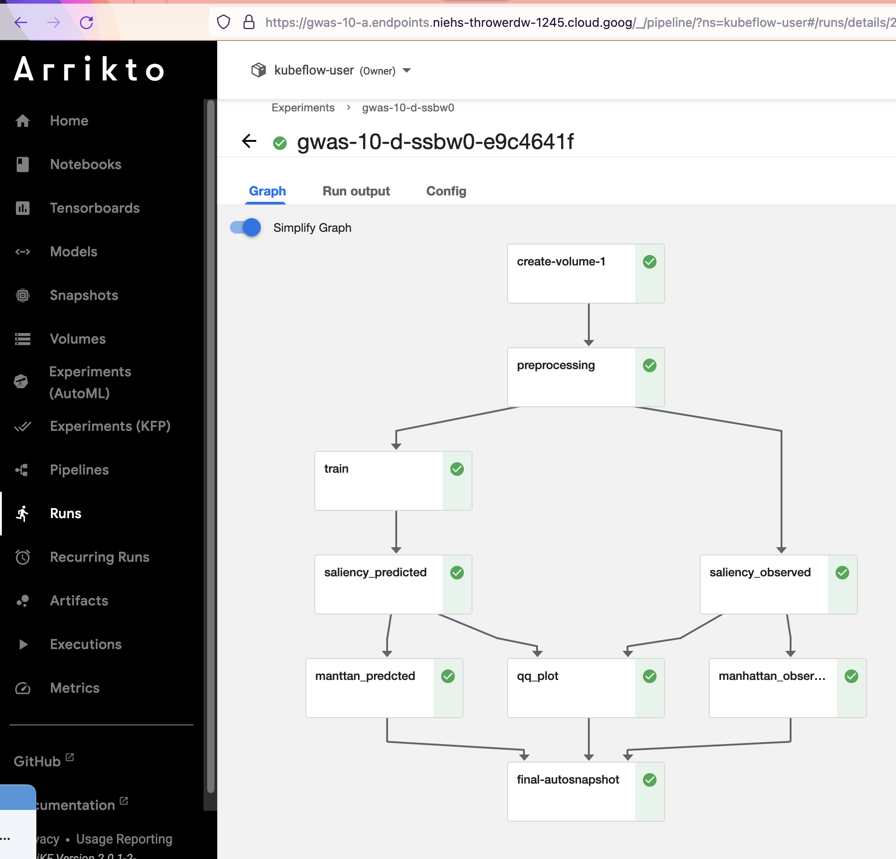
    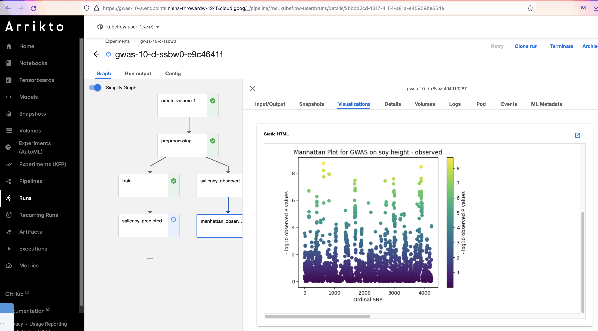

## Step 1: Make sure that the required APIs are enabled.

On GCP, many services are turned off by default for security reasons, because GCP supports many customers that work in regulated industries such as healthcare, defense, and financial services. Since we are working in a project that is designated for running academic experiments and is segregated from production resources, we can safely enable some of these services as are necessary for this experiment.

1. Log into GCP with your NIH credentials `https://cloud.google.com`. After that click *console* in the upper right corner of the page.
2. Accept any terms of service if prompted.
3. On the main GCP console menu on the left, find [APIs and services] > library.
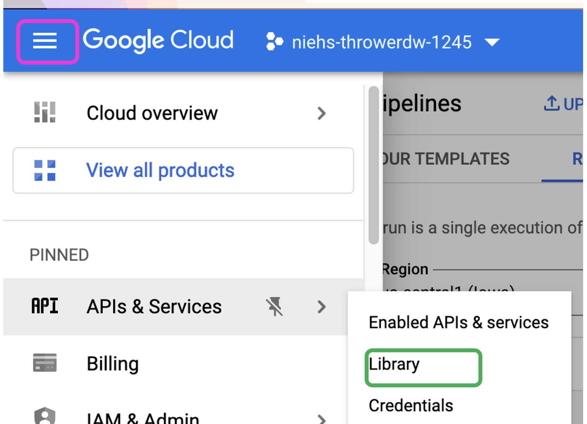
4. On the search field that appears on the top of the screen, paste `serviceusage.googleapis.com`.
5. Click *enable*.
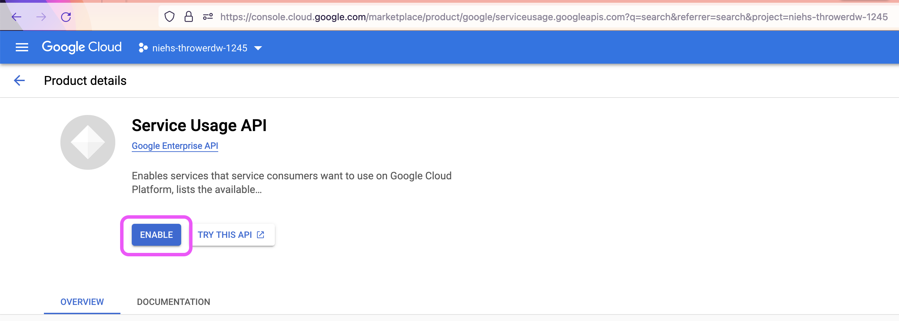
6. Repeat this, this time find and enable, `servicemanagement.googleapis.com`
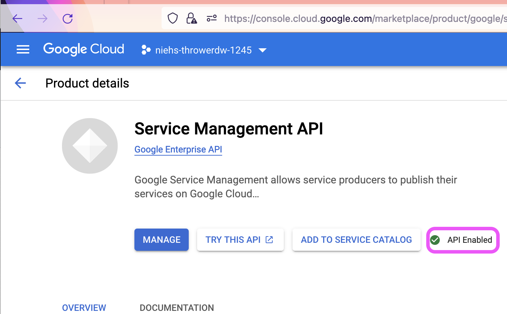
8. Repeat this, this time find and enable, the compute engine API.
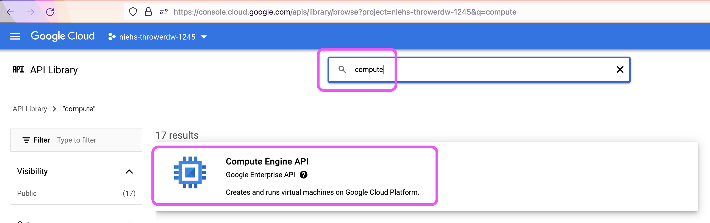
9. When you follow the downstream steps, you may be prompted to enable additional APIs. If so, repeat this as necessary.

## Step 2: Deploy minikf kubeflow:

Minikf is a small deployment of Kubeflow on a minikube Kubernetes instance. These minikube instances are single machine Kubernetes clusters that are meant for development use. For tasks this size that don't need to true highly available distributed HPC cluster to run, this is ideal, as these are easy to deploy when needed and delete when not. At current pricing at the time of this writing, the optimal scale of machine we need to run this job costs about $0.50 an hour.

1. On the main GCP console menu on the left, find the GCP marketplace.

2. When the marketplace page opens, enter in its search bar "minikf".
3. Click on *Arrikto minikf*.
4. Set the configuration for your minikf deployment:
    1. Give it any suitable name you want.
    2. Also change the machine type to any machine in the N2 family or its successor, having **16 CPU and 64 GB ram, n2-standard-16 at the time of this writing**.
    3. Don't get sticker shock on the monthly price. This is what you would pay if you left this running continuously, which I don't recommend doing. Here, we will use this for a few hours, make a copy of important data, then delete the instance.  The price is pro-rated to the hours used.
    4. Provisioning a GPU is not necessary, but a GPUs it will make the experiment complete much more quickly once it is deployed on the cluster. Unless you are already familiar with the platform, I would recommend experimenting first without the GPU. They are a little expensive and it may take a little time to get the task deployed on the cluster until you are used to the setup. You probably don't want to pay for a GPU that's sitting idle while we fumble around the system.
    5. Leave all the other fields as default and click the *deploy* button at the bottom of the page.
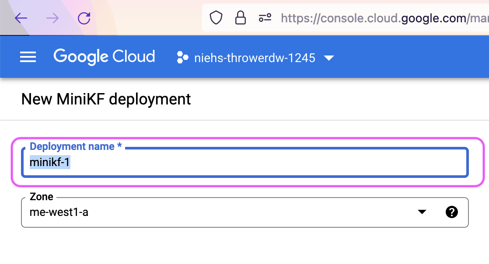
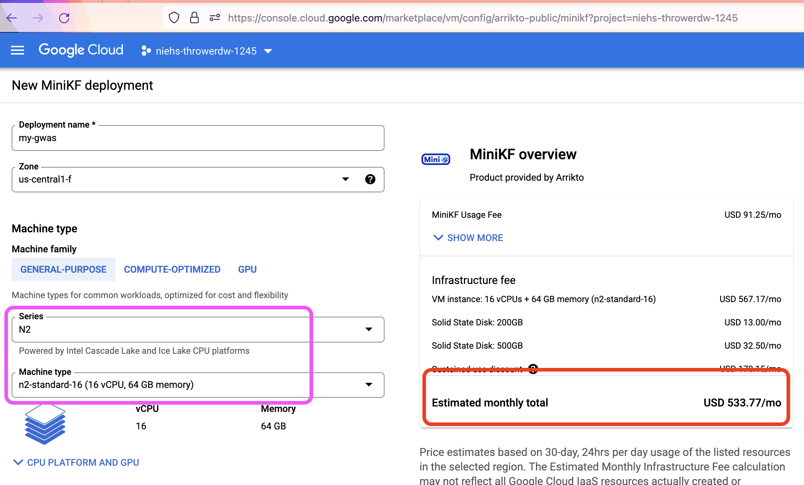
5. When  the page that pops up tells you that the deployment was successful, click the button [ssh].
    1. A terminal should pop up. Pay attention to the browser for "pop up blocked" if this does not appear and enable popups from GCP if necessary.
    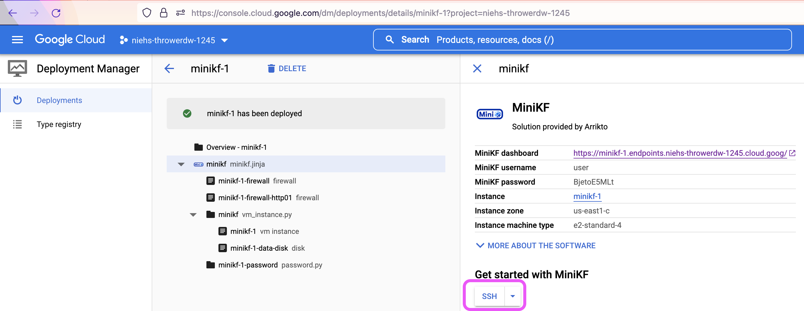
    2. When this terminal pops up, type: `gcloud services enable servicemanagement.googleapis.com`. If this throws errors, go back to "[APIs and services] > [library] and enable `serviceusage.googleapis.com`. Then close the ssh terminal, open a new one, and re-try `gcloud services enable servicemanagement.googleapis.com`. (This isn't an error. Yes we have to enable it here too). It doesn't make sense why, we just do...
    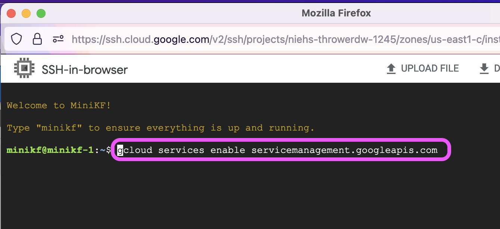
    3. Type: `minikf` and press enter.
    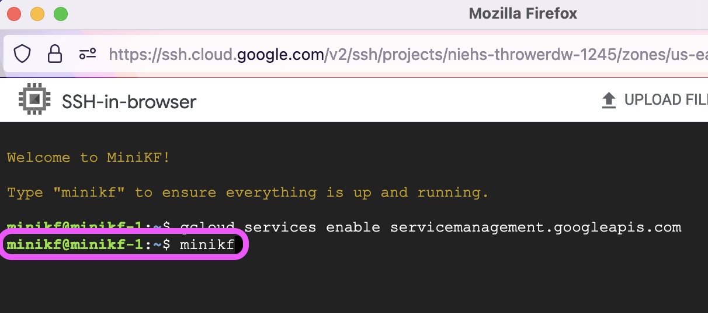
    3. Wait for it to tell you that minikf is ready. If this freezes up with the caption at "exposing services 33% progress" for more than 10 minutes, submit a help ticket on the **NIH** service desk and reference minikf and kubeflow.
6. When the terminal tells you minikf is ready, you may close the terminal and from the web page on GCP where you deployed this, click the link to the dashboard that the marketplace page on GCP gives you. Log in with the user and password that the page gives you.  

## Step 3: create your Jupyter notebook:

1. Click on *Notebooks* and click on "new" or "+" button.
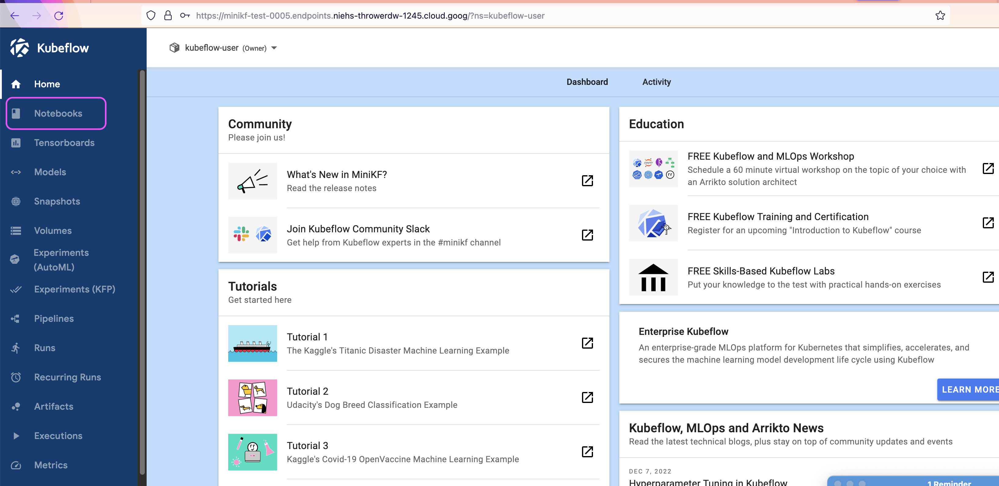
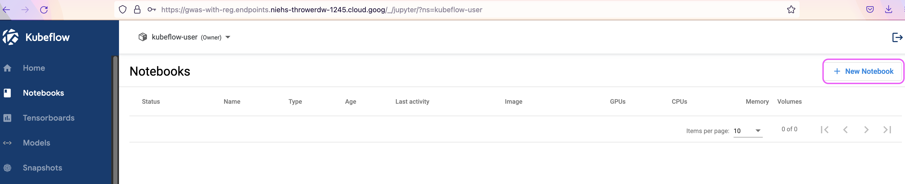
2. Configure the notebook to:
    1. any suitable name
    2. For docker image, pick any image having a name that includes both **"tensorflow"** and **"kale"**. Tensorflow is required for the script to run, and Kale will automatically compile and submit your pipeline for you.
    3. Provisions this notebook with 4.5 CPU and 9 GB of RAM.
    4. No GPU.
    5. Leave the "Workspace Volume as its default."
    6. For "Data volume", click "+" and leave what comes up as its default.
    7. Make sure "Allow access to Kubeflow Pipelines, Allow access to Rok" is selected.
    8. Make sure "enable shared memory is selected". This allows all the workers running the jobs in parallel to use a flexible shared pool of memory.
    8. Click *Launch*.
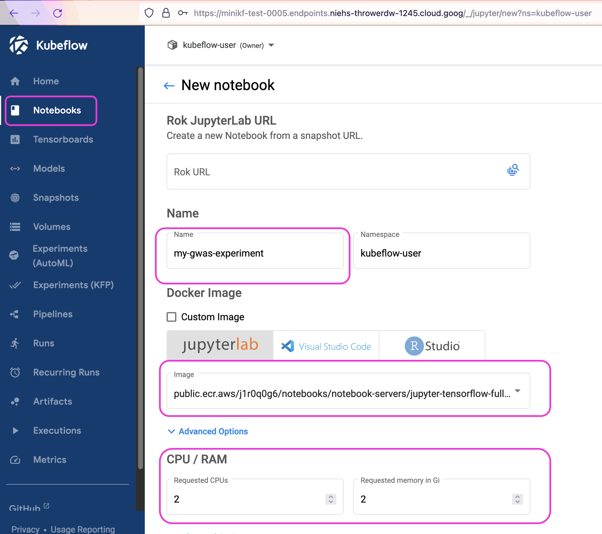
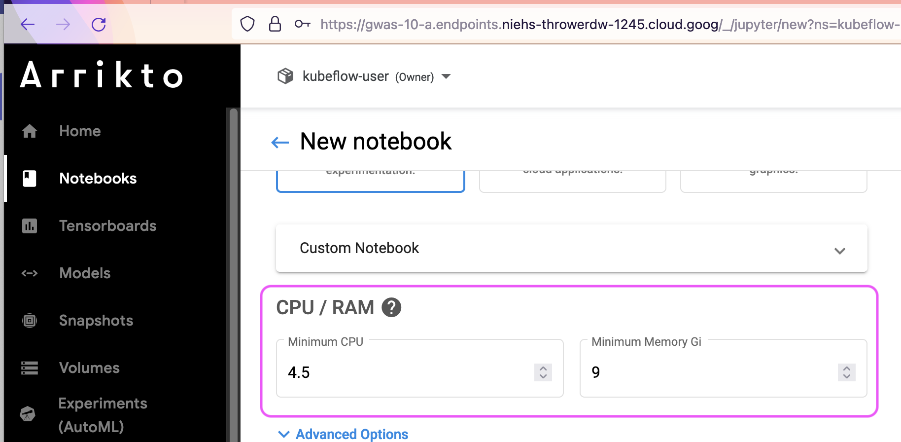
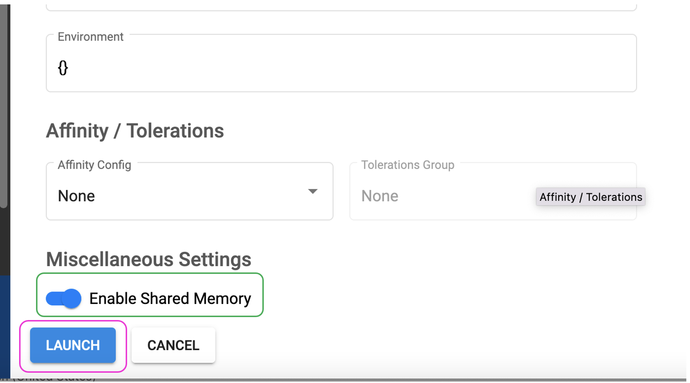
    9. When the green checkmark shows that the notebook is ready, click [connect].
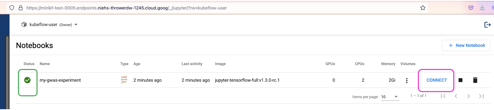

## Step 4: Run the notebook in the notebooks environment.

If you chose a jupyter tensorflow container above, this should have the Kale notebooks extension. Click on the extension and make sure it's enabled. Also note the control for "Hyperparameter tuning with Katib". Leave this off for now, but we will revisit this one soon:

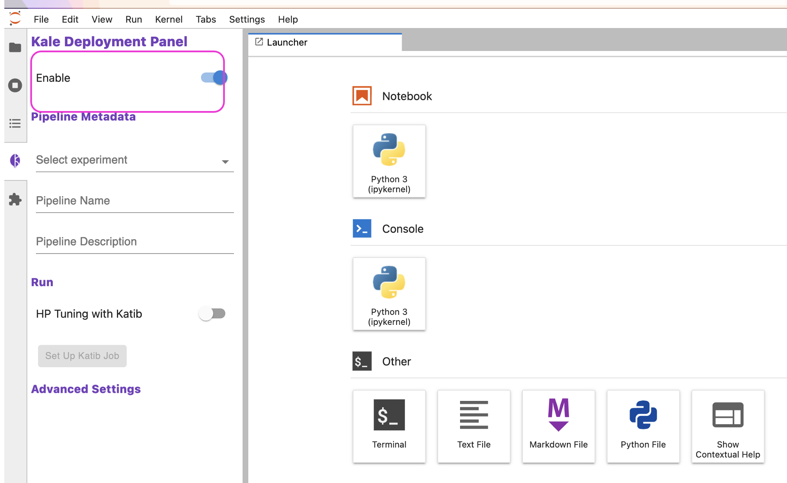

1. Upload the notebook "a1gwaskaleversion.ipynb" from this folder and the sequence file "IMP_height.txt" to the notebooks environment. You can do this one of 2 ways:
    1. Open a Jupyter terminal and run `git clone [the url for this repo]`. then `cd ...`  into this directory. Note that the url you will use will be [ADD URL], since I was copying the notebook from a development copy of the repo.
    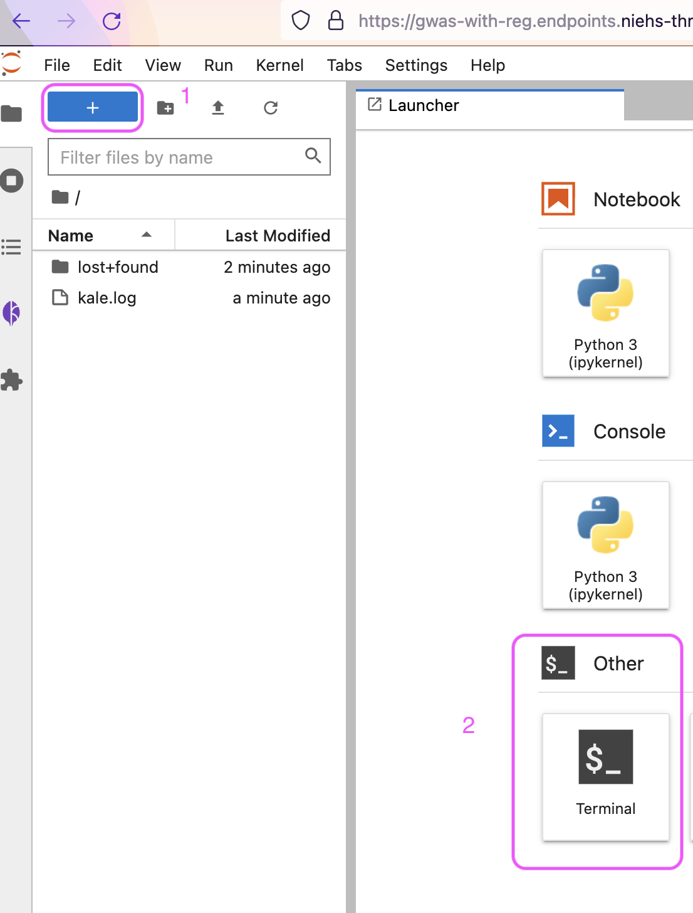
    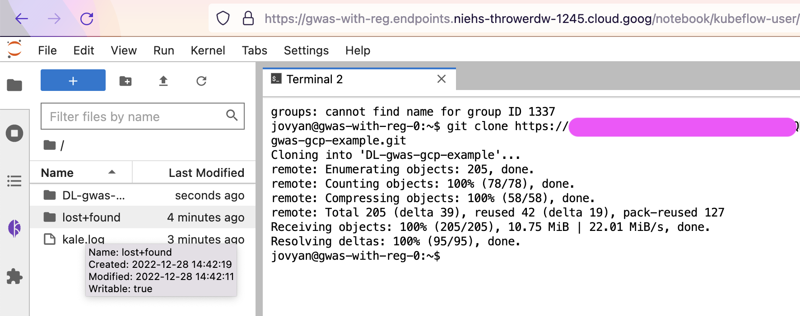
    2. Download these 2 files, then upload them from the Jupyter files UI this way:
    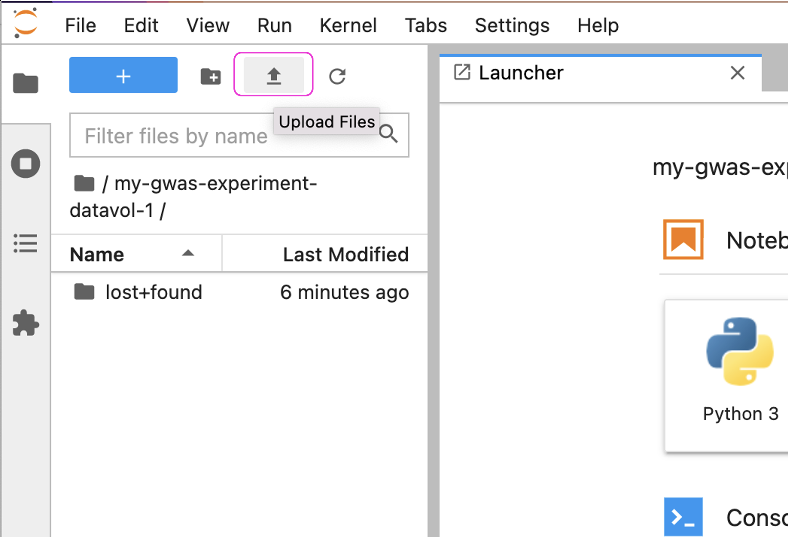
2. The kale notebook will add a selector to the right of each cell. When you click it, a menu opens above the cell. You must make a selection from this for each cell before you ask Kale to submit your job. This will tell Kale what purpose the cell serves in the pipeline [3] and how it should contextualize the cell's content. On the first 2 cells, select "skip".
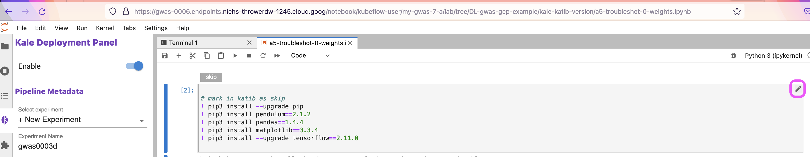
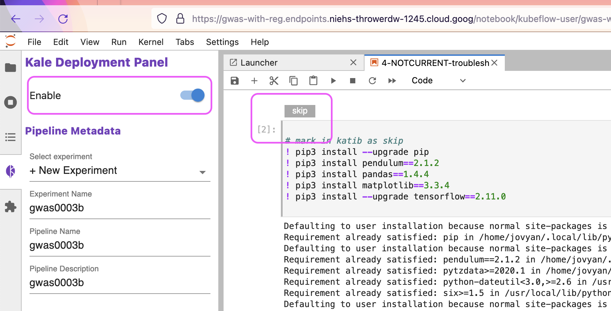
3. Run the first cell. It will install the updated version of Tensorflow, which will enable XLA, which should make the job run much more quickly, and other libraries. Since the options to use XLA are selected, the job will error out if this is not updated.
    - If you are curious what XLA is, and want to read on, XLA or accelerated linear algebra is a processor (hardware) technology that allows the processor to do multiple tandem mathematical operations in one step without caching intermediate results, instead of the traditional way we do math where we complete the first operation, save the result of it, and then perform the second operation on the saved output of the first one. Basically the chip has a large and complex block of transistors arranged where it can be given the operands, the 2 desired operations and their order, and will perform, for example a "multiplication-addition" in one step. This is of course much faster than the old fashioned approach, but the downside is that it needs to be compiled with machine - specific C library options. The newer versions of Tensorflow have an option that lets you tell Tensorflow you want it to "JIT" compile its operations for XLA. JIT compiling also does other hardware - level optimizations, such as "function inlining", which basically means that the compiler does some specific refactoring of the code in the background to make it run faster. If you are curious to read more about this, you can here [4] ...
4. Run the second cell. **Wait for a popup to appear asking you if you want to restart the kernel and click [ok] before you run the cells after this.** It will restart the Jupyter kernel, so the upgrades become effective. If you run the next cell before clicking OK, the notebook will freeze up, and you will need to restart the kernel yourself.
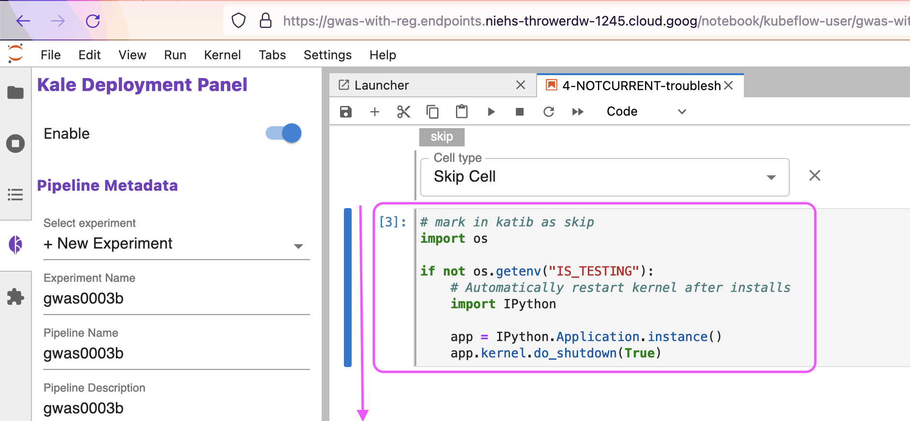
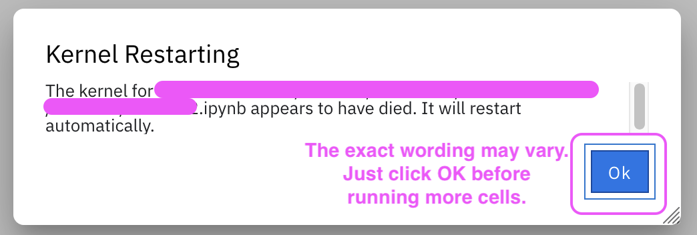
5. For the remaining cells:
    - Set the 3rd cell as imports and run it.
    - Set the 4th cell as "pipeline parameters" and run it.
    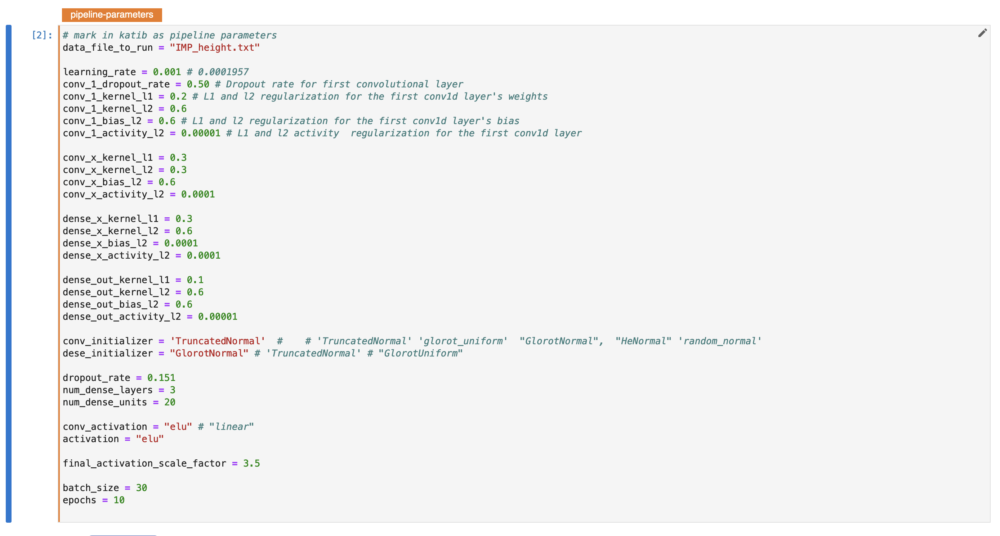
    - Set the 5th cell as "a pipeline step". In the example, I named it "preprocessing", but you can name it anything you want that. For depends on, leave blank.
    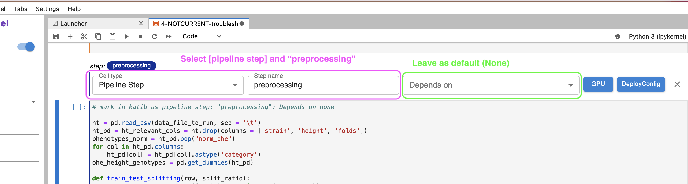
    - For the 6th cell, set it as a pipeline step. In the example, I named it "train". In this one, set the depends on field to the name you assigned to the last cell. The purpose of the depends on field is to set the order of workflow steps. By default, Kubeflow always runs in separate execution environments on the cluster, and in addition to this, unless you tell it to do otherwise, Kubeflow will also try to run all workflow steps in parallel. If one step depends on the output of another step as its input, this will fail out. In this case, this is the same, because the first step of the workflow is a data preprocessing step. It takes in one tab delimited CSV sequence file, train-test splits it, reformats it to be amenable to a 1-d convolutional layer, and then saves the train data, train labels, test data, and test labels in separate files. The second step trains and and tunes a neural network on the data which the first step prepared. Since the second step needs files that the first step will create, we can't run these in parallel. The data preprocessing must be completed first.
    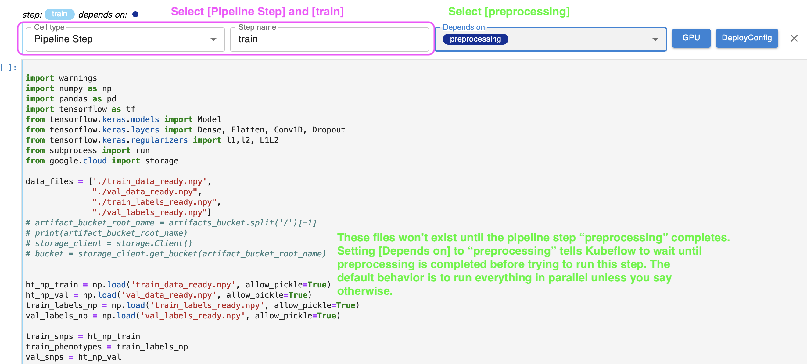
    - For the last step, set this as "pipeline metrics". This will return the metric "val_mean_absolute_error" which the Katib tuner will try to minimize.
    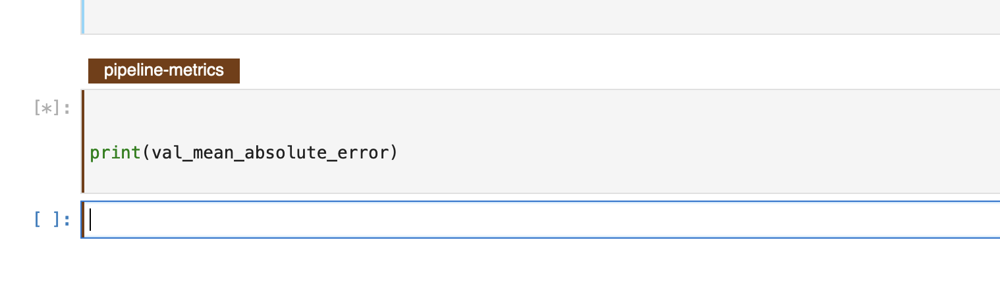

## Step 5: Configure Katib, compile your job, and submit it. (last step, and Kubeflow has it from here.):

1. In the Kale panel to the left: Enable the hyperparameter tuning with Kale. A menu will open.
2. Click *Set up Katib Job*.
    1. Checkbox each box for the pipeline parameters and set the following:
        - All l1 and l2 regularizations: 0.0000001 to 0.9        
        - learning_rate: min 0.0001 max 0.3 step: .001 # Avoids overshooting an optimal solution when adjusting the kernel weights (weights are the "m" in the y = mx + b model) A neural network is just a chain of m3(m2(mx + b) + b2) + b3, with an activation function nested between each layer that adds non-linearity so it can't collapse to a single layer.
        - dropout_rate: min 0.01 max 0.95 step 0.1 # Prevents overfitting; allows a more complex and robust model to be used without overfitting.
        - num_dense_layers: min 1 max 5 step 1
        - conv_activation and activation: elu, relu, gelu, linear (which activation function  will be used; As a note, most textbook examples teach you to use relu. Elu is often said in an out of context way to be "more computationally expensive". In reality, models trained with elu usually reach convergence within a few epochs, sometimes in as few as 1 /20 as many epochs, making the higher per - epoch computational expense a moot problem in many cases, unless the celling of available ram and GPU power is barely able to compute the gradient for your task with relu. Elu usually wins out, but we will let the tuner figure what works best here in this specific case.)
        - batch_size: min 5 max 35 step 1 # If you run into "out of memory" errors, then reduce the maximum.
        - epochs: min 1 max 15 step 1
        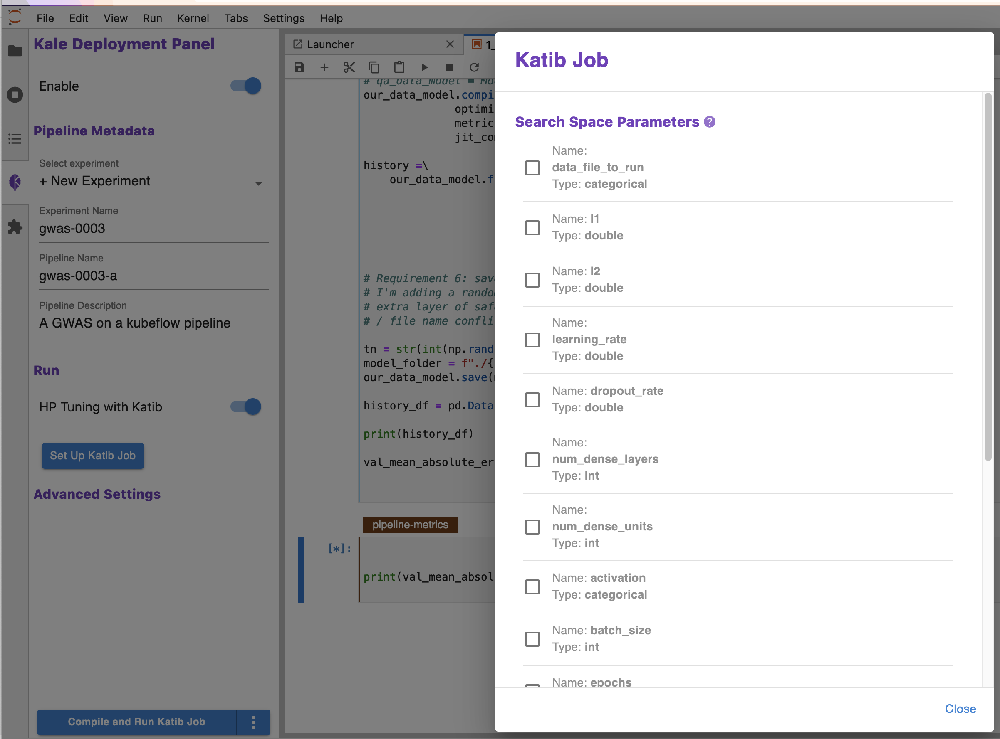
    2. Select the Bayesian > Gaussian tuner. Leave the other tuner options as defaults and set it to run 3 trials in parallel and set it to run 35 trials in total (The tuner will probably converge on an optima well before that, but just in case your run does a little better than mine ... . Leave the other tuner's settings as the defaults, unless you are familiar and have recommendations on how we may improve its performance. If you do, open an issue and pull request on Github so we can make this better as we go.
    3. Click *Close*.
    4. Select advanced options for the storage.
        - Advanced settings
        - **Make sure "Docker image" is blank.**
        - Storage class default
        - Read write many
        - Use notebook volume
        - Take ROK snapshot during each step
        - 5GB
        - Second volume: None
        - Everything else defaults

        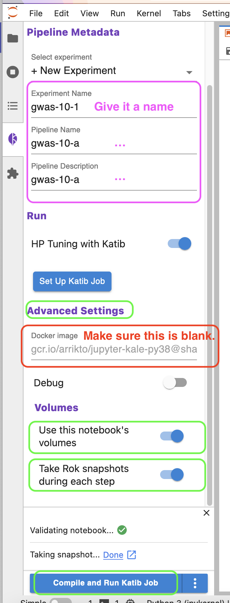

    5. Click [Compile and Run Katib Job]
    6. Confirm it submitted successfully.
    7. Click on the browser tab where main Kubeflow dashboard is open.
        - Click on the *Runs* tab.
        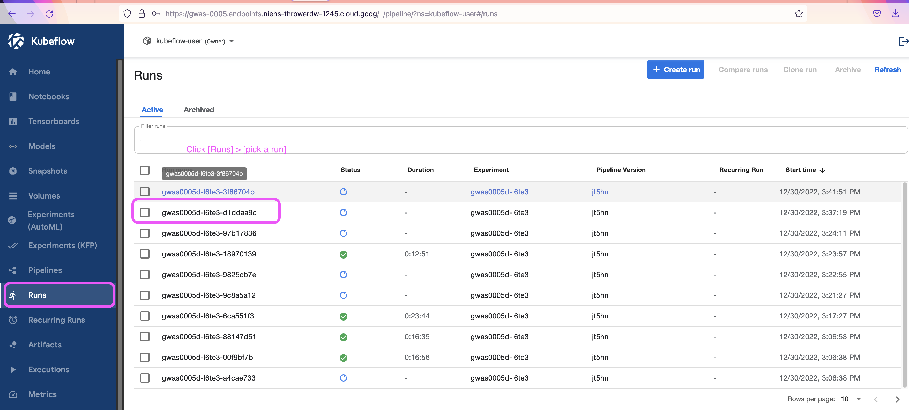
        - Once you have opened a run, click on a pipeline step.
        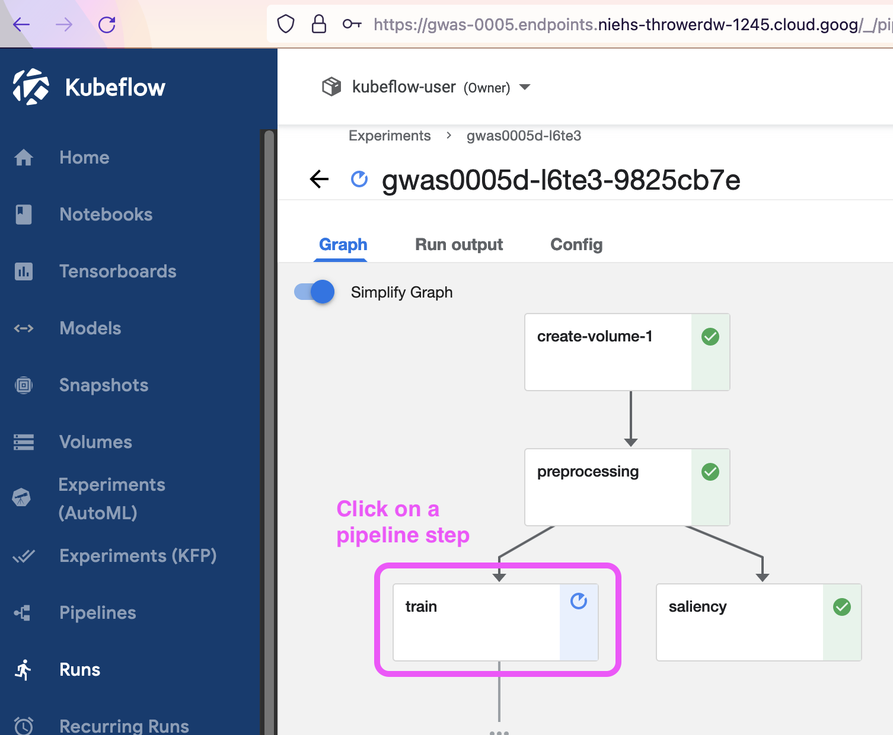
        - On a step, click its *logs*.
        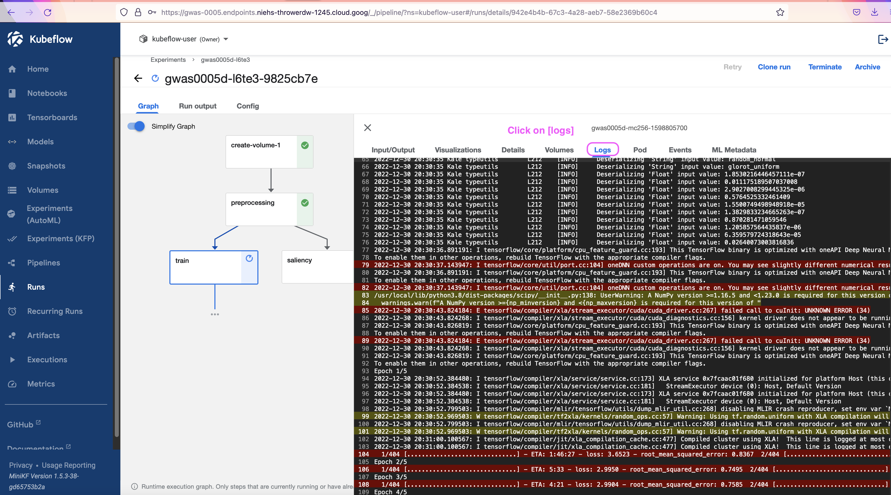
        - There are a few other useful tabs here like the the inputs and outputs of a step which list the hyperparameters and metrics which a step returned.
        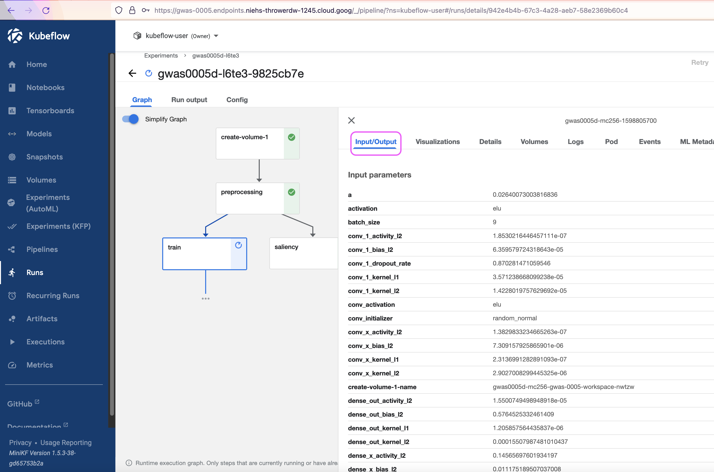
        - Click on experiments automl (Katib), then click on *your experiment*.
        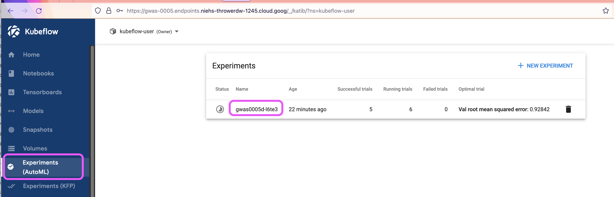
        - Once the first 3 runs have completed, return here.  Notice the parallel coordinates visualization that shows the patterns in the parameters chosen for the trials and which subset of the  hyperparameter space is contributing to the best model performance. Once several trials have completed, this will be very informative. The one in this example is a bit cluttered, I admit, as it has so many hyperaprameters. For most tasks, however, this visualization will make it clear what is tending to work and what isn't.
        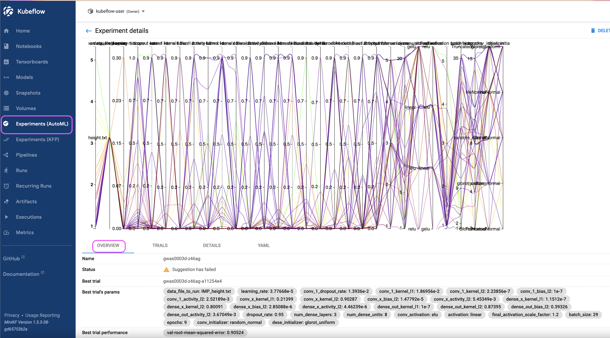
        - Feel free to find something else to do for about 2 - 3 hours. Kubeflow and Katib will continue running the experiment even if you are not logged in. In 2 - 3 hours, you can return to the [experiments AutoML] page, and it will provide the best hyperparameters it found among the trials and the validation mean absolute error for the best trial. You can run the train task with these parameters and get the model to use for further work. Alternatively, you can set the option [make a rok image of of each trial]. Visit these pages and see your results. Take screenshots. (In Windows (r), search for the snipping tool. In Mac, press  "[command] + [shift] + 4"). Write down the best parameters it found. You will need these in the second notebook.
        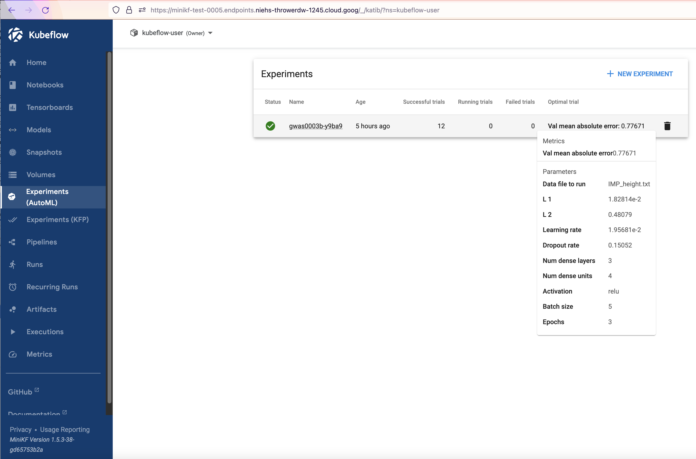
        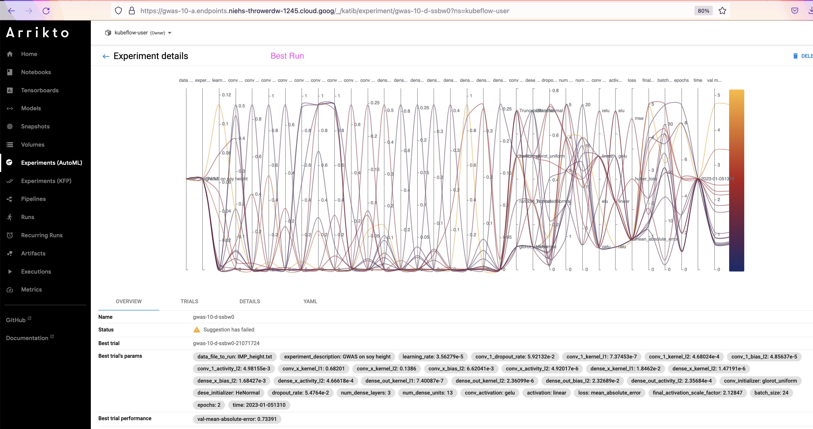
        - Once you are sure you have a copy of everything you want, go back to the page in the deployment manager and delete the deployment, so you don't keep being billed for it. We recommend selecting the option to delete everything "disks, VPC settings, ...". The SSD disks that this uses are a little expensive.
        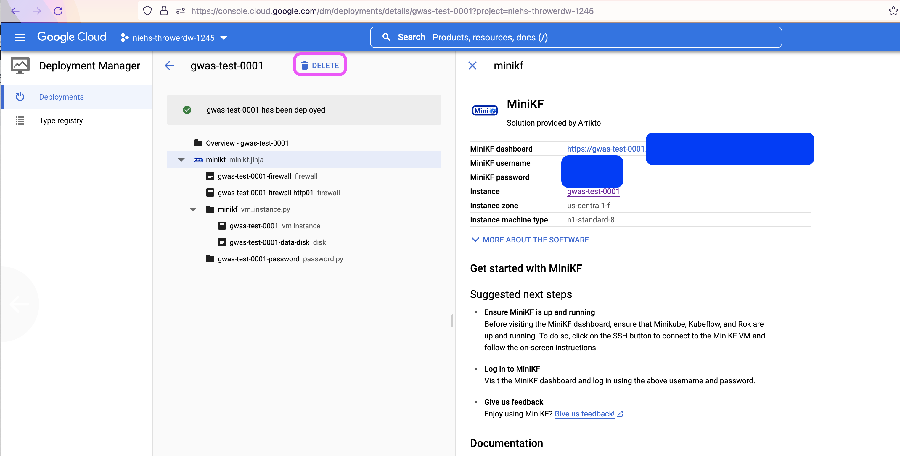

## References

- [0] https://colab.research.google.com/github/kmkarakaya/ML_tutorials/blob/master/Conv1d_Predict_house_prices.ipynb
- [1] https://www.epj-conferences.org/articles/epjconf/abs/2021/05/epjconf_chep2021_02067/epjconf_chep2021_02067.html
- [2] https://www.kubeflow.org/docs/started/introduction/
- [3] https://docs.arrikto.com/features/pipelines/jupyterlab/cell-types.html#imports-cells
- [4] https://www.greenend.org.uk/rjk/tech/inline.html
- [5] https://en.wikipedia.org/wiki/Neural_architecture_search
